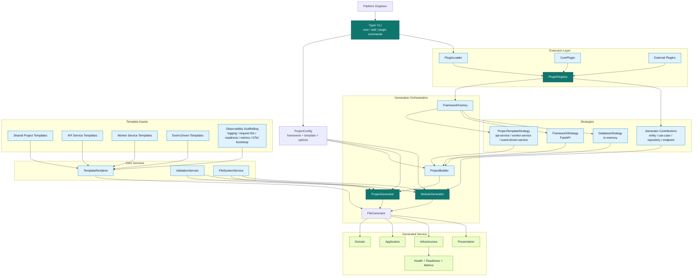

# archforge

ArchForge is a developer CLI platform for scaffolding production-ready Python backend services with Clean Architecture, explicit boundaries, and maintainable delivery tooling.

## Overview

ArchForge generates FastAPI services that separate domain, application, infrastructure, and presentation concerns from the start. The generated projects are designed around repository and unit of work abstractions, dependency injection, structured logging, environment-based configuration, Docker packaging, and a practical test layout.

## Features

- Typer-based CLI with `new` and `add` workflows
- Plugin registry and dynamic plugin loading
- Multiple built-in service templates: `api-service`, `worker-service`, `event-driven-service`
- Clean Architecture service layout under `src/`
- Repository Pattern and Unit of Work abstractions
- Dependency injection-ready composition layer
- Pydantic-based settings management
- Observability scaffolding with structured logging, request IDs, readiness, metrics, and OpenTelemetry-ready bootstrap
- Dockerfile and docker-compose support
- pytest, coverage, ruff, and mypy-ready repository setup
- Jinja2 template system for consistent project generation

## Architecture Philosophy

ArchForge favors strict dependency direction. Domain code remains framework-agnostic, application code depends on interfaces instead of concrete infrastructure, and presentation concerns stay isolated from business rules. Patterns are applied deliberately where they improve maintainability: Factory for framework selection, Builder for template manifests, Strategy for framework and database choices, and Template Method for the generation lifecycle.

## Architecture Diagram



## Installation

```bash
pip install archforge
```

For local development:

```bash
pip install -e .[dev]
pre-commit install
```

## CLI Usage

Create a new service:

```bash
archforge new billing-service
```

Create a specific service template:

```bash
archforge new job-runner --template worker-service
archforge new order-events --template event-driven-service
```

Pass template or plugin configuration options:

```bash
archforge new billing-service --option region=us-east-1
archforge new billing-service --template api-service --framework fastapi --database in_memory
```

Extend an existing service:

```bash
archforge add entity invoice
archforge add use-case create-invoice
archforge add repository invoice
archforge add endpoint invoices
```

Generated services include optional observability flags via environment-backed settings:

```bash
STRUCTURED_LOGGING_ENABLED=true
REQUEST_ID_ENABLED=true
READINESS_ENABLED=true
METRICS_ENABLED=false
OTEL_ENABLED=false
```

## Generated Project Structure

```text
billing-service/
	src/
		domain/
			entities/
			repositories/
			services/
		application/
			dto/
			interfaces/
			use_cases/
		infrastructure/
			config/
			logging/
			observability/
			persistence/
			repositories/
		presentation/
			api/
			dependencies/
			schemas/
	tests/
		unit/
		integration/
		e2e/
	Dockerfile
	docker-compose.yml
	pyproject.toml
	README.md
	.env.example
```

## Design Patterns Used

- Factory Pattern
- Builder Pattern
- Strategy Pattern
- Template Method
- Repository Pattern
- Unit of Work
- Dependency Injection

## Examples

See [examples/generated_service/README.md](examples/generated_service/README.md) for a representative generated project snapshot.

## Testing And Development

```bash
make install
make lint
make typecheck
make test
make coverage
```

## Roadmap

- Additional framework strategies
- Optional relational persistence integrations
- Router and dependency registration enhancements for add commands
- Expanded template customization options
